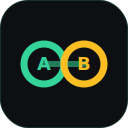
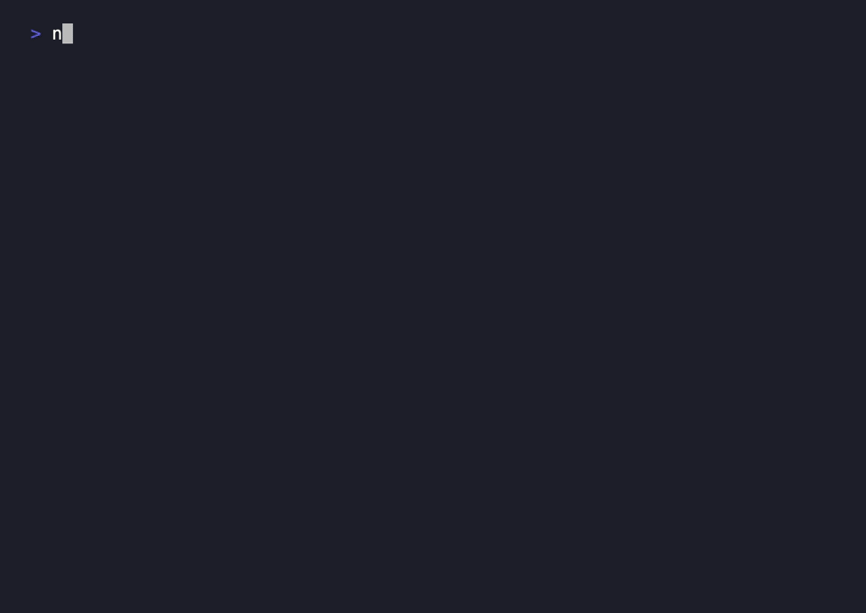

<p align="center">
  
</p>

<h1 align="center">friskeval</h1>

<p align="center"><b>Routing linter for a skill catalog — catch collisions and scope overclaim before you ship a skill.</b></p>

<p align="center">
  🇺🇸 English · <a href="README.id.md">🇮🇩 Bahasa Indonesia</a> · <a href="README.zh-CN.md">🇨🇳 简体中文</a>
</p>

<p align="center">
  
  
  
  
</p>

<p align="center">
  
</p>

friskeval is the check an agent runs on its **own skill catalog** (Claude Code —
also Codex, Cursor, Gemini CLI, opencode) before shipping a new skill. A skill's
`description` is the only thing the router reads to decide when to fire it, so two
overlapping descriptions silently compete for the same prompts and nothing crashes to
warn you. friskeval measures that overlap — deterministically, offline, no tokens —
and refuses "done" while a new skill collides with one already in the catalog.

## Before / After

**Without friskeval** — you add `gatefrisk` and later widen its description to also
mention "agent hooks that auto-run untrusted input". It now quietly competes with
`hookfrisk` for hook-audit prompts. Cosine similarity is only 0.21, so a plain
duplicate check says "fine". Real audits start landing on the wrong skill and you
never find out:

```
$ git commit -m "feat: broaden gatefrisk"
# ships. no error. hookfrisk prompts now sometimes route to gatefrisk.
```

**With friskeval** — the scope-overclaim check names the exact borrowed vocabulary
before you ship:

```
friskeval — 7 skills · 1 issue
  ✓ collision   gatefrisk ~ hookfrisk = 0.21   (under 0.5)
  ⚠ overclaim   gatefrisk carries 50% of hookfrisk's domain terms
                [hook, command, input] → drop them or narrow gatefrisk
  ✓ routing     21/21 prompts rank their owner first
cosine said "ok" — overclaim caught it. Fix the description before done.
```

## Real runs

Not a mockup. Actual friskeval runs in Claude Code — see **[CASES.md](CASES.md)**.

## Install

```bash
# macOS / Linux / WSL
curl -fsSL https://raw.githubusercontent.com/ryanda9910/friskeval/main/install.sh | bash

# Windows (PowerShell)
irm https://raw.githubusercontent.com/ryanda9910/friskeval/main/install.ps1 | iex
```

Finds every coding agent you have and installs the skill into each. ~10 seconds,
safe to re-run. `--project` also installs into the current repo's `.claude/`. No
key, no account, no dependency.

Manual: copy [`skill/SKILL.md`](skill/SKILL.md) into your agent's skills/rules dir
(Claude Code: `~/.claude/skills/friskeval/SKILL.md`).

## Documentation

Full docs in **[docs/](docs/)** — [usage](docs/usage.md) · [reference](docs/checklist.md) ·
[install](docs/install.md) · [customizing](docs/customizing.md) · [FAQ](docs/faq.md) ·
[real runs](CASES.md) · [contributing](CONTRIBUTING.md).

## Works in

Claude Code (native skill), plus any agent that loads a rules/skill file — Codex,
Cursor, Gemini CLI, opencode, Aider, GitHub Copilot CLI.

## License

MIT.
